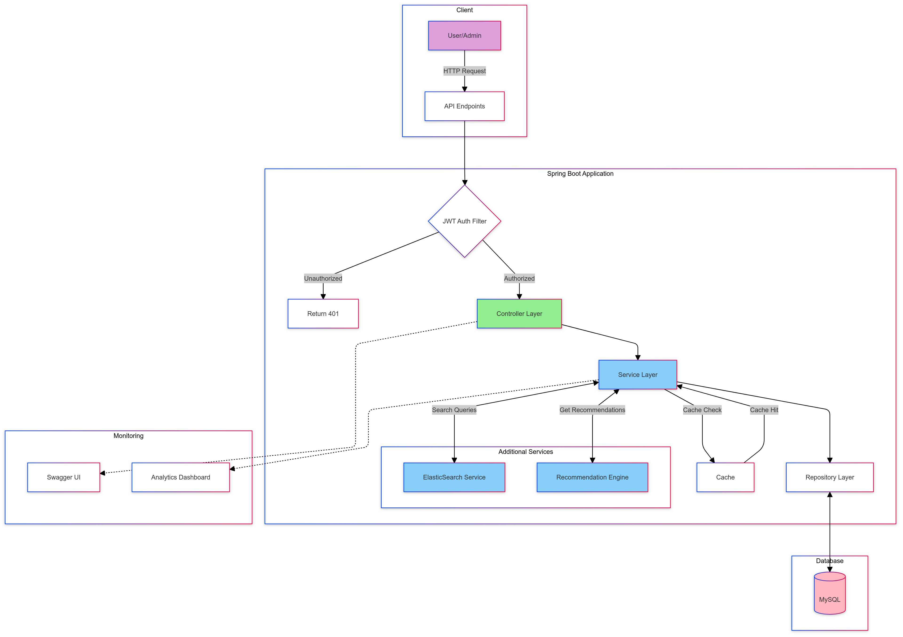

# Spring Boot Bookstore API

A comprehensive RESTful API for managing a modern bookstore, built with Spring Boot and MySQL.

## System Workflow



## Workflow Summary

1. **Client Interaction**
   - Users and admins interact with the system through RESTful API endpoints
   - Supports various operations based on user roles

2. **Security**
   - JWT-based authentication
   - Role-based access control (Admin/User)
   - All requests validated through security filters

3. **Core Components**
   - **Controllers**: Handle HTTP requests and route to appropriate services
   - **Services**: Implement business logic and orchestrate data operations
   - **Repositories**: Manage data persistence using Hibernate/JPA
   - **MySQL Database**: Stores application data

4. **Enhanced Features**
   - Caching mechanism for improved performance
   - ElasticSearch integration for efficient searching
   - Book recommendation system
   - Analytics dashboard for monitoring

5. **Documentation & Monitoring**
   - Swagger UI for interactive API documentation
   - Real-time analytics for admin users

## Key Features

- Complete book management system (CRUD operations)
- Advanced search functionality with filters and pagination
- User authentication and authorization
- Book ratings and reviews system
- Recommendation engine
- Analytics and reporting
- Comprehensive API documentation

## Tech Stack

- **Backend**: Spring Boot 2.x
- **Database**: MySQL
- **ORM**: Hibernate
- **Security**: Spring Security, JWT
- **Search**: ElasticSearch
- **Documentation**: Swagger/OpenAPI
- **Testing**: JUnit, Mockito

## Getting Started

### Prerequisites

- Java 11 or higher
- Maven
- MySQL
- ElasticSearch (optional, for advanced search)

### Installation

1. Clone the repository
```bash
git clone https://github.com/yourusername/bookstore-api.git
```

2. Configure database
```properties
spring.datasource.url=jdbc:mysql://localhost:3306/bookstore
spring.datasource.username=your_username
spring.datasource.password=your_password
```

3. Run the application
```bash
mvn spring-boot:run
```

The API will be available at `http://localhost:8080`

## API Documentation

Access the Swagger UI at `http://localhost:8080/swagger-ui.html`

### Key Endpoints

- `POST /api/books` - Add a new book (Admin only)
- `GET /api/books` - Search books with filters
- `POST /api/users/signup` - Register new user
- `POST /api/users/login` - Authenticate user
- `POST /api/books/{id}/reviews` - Add book review

## Testing

Run the test suite:
```bash
mvn test
```

## Deployment

The application can be deployed to various platforms:
- Heroku
- AWS
- Any container orchestration platform (Docker/Kubernetes)

## Contributing

1. Fork the repository
2. Create your feature branch (`git checkout -b feature/AmazingFeature`)
3. Commit your changes (`git commit -m 'Add some AmazingFeature'`)
4. Push to the branch (`git push origin feature/AmazingFeature`)
5. Open a Pull Request

## License

This project is licensed under the MIT License - see the [LICENSE.md](LICENSE.md) file for details